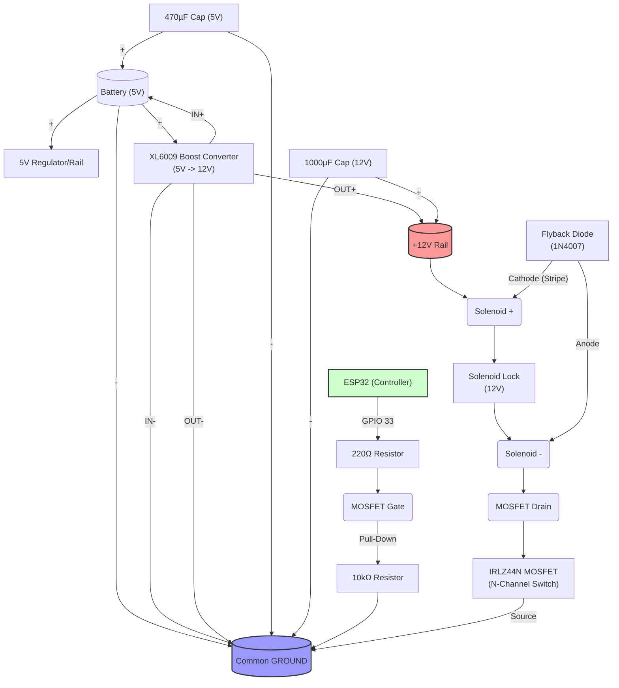

# Solenoid Latch Migration Guide

## Overview
Switching from electromagnetic locking to a solenoid latch system. This architecture reduces power consumption (no holding current) and heat generation.

## Hardware Specifications

### Power Architecture
*   **Source**: 5V (Battery/Bank)
*   **Boost Converter**: HiLetgo XL6009
    *   Input: 5V Rail (MUST be > 2A Source, e.g. Battery Bank)
    *   Output: 12.0V (Adjusted via trim pot)
*   **Capacitance**:
    *   **1000 µF** 25V Electrolytic → Across **12V Rail** (Output Buffer)
    *   **470 µF** → Across **5V Rail** (Input Buffer)

### Control Circuit
*   **Switching**: IRLZ44N N-Channel MOSFET (Logic Level)
*   **Protection**: 1N4007 Flyback Diode (Stripe to +12V)
*   **Resistors**:
    *   220 Ω: ESP32 GPIO → Gate
    *   10 kΩ: Gate → GND (Pull-down)

### Solenoid
*   **Spec**: 12V Cabinet Solenoid, ~350mA
*   **Spec**: 12V Cabinet Solenoid, ~350mA
*   **Duty Cycle**: Pulse Only (500ms)

## Visual Wiring Diagram


## Wiring Diagram

### Power & Ground Distribution
```text
Battery (−) ────┬──── ESP32 GND
                ├──── XL6009 VIN−
                ├──── XL6009 VOUT−
                ├──── MOSFET Source
                └──── Capacitor (−) Leads

Battery (+) ────┬──── ESP32 5V
                └──── XL6009 VIN+
```

### High Voltage Side (12V)
```text
XL6009 VOUT+ ───┬───────────────────────────► Solenoid V+
                │
                └──[ Diode (Stripe) ]◄──────┐
                                            │
XL6009 VOUT− ───────────────────────────────┼──► GND
                                            │
MOSFET Drain ───────────────────────────────┘──► Solenoid V−
```

### Control Signal
```text
ESP32 GPIO 33 ──[ 220 Ω ]──► MOSFET Gate
                             │
                             └──[ 10 kΩ ]──► GND
```

## Firmware Logic transformation
*   **Old**: Hold Relay Open/Closed `setLock(state)`
*   **New**: Momentary Pulse (500ms) to Unlock. 
    *   Logic: `digitalWrite(HIGH)` -> `millis() wait 500ms` -> `digitalWrite(LOW)`
    *   Note: Solenoid MUST NOT be held high.

## Safety Checklist
1.  [ ] Common Ground established between 5V, 12V, and ESP32.
2.  [ ] Flyback diode installed (Stripe facing +12V).
3.  [ ] MOSFET Pull-down resistor verified (prevents boot floating).
4.  [ ] Boost converter tuned to 12.0V *before* connecting solenoid.
